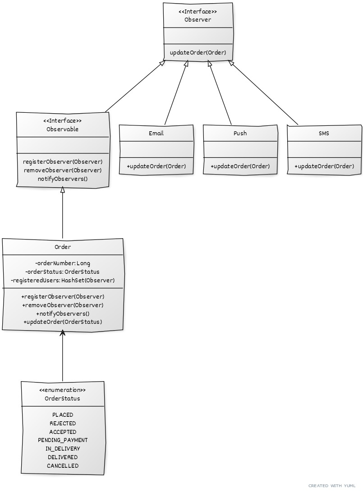

# messaging-system. 
  
This repo is imitating a messaging system. Its architecture is based on the implementation of the Observer design pattern.
  

After changing the status of the order, notifications are triggered and the app prints out messages for each channel-like instances: Email, Push, SMS.
